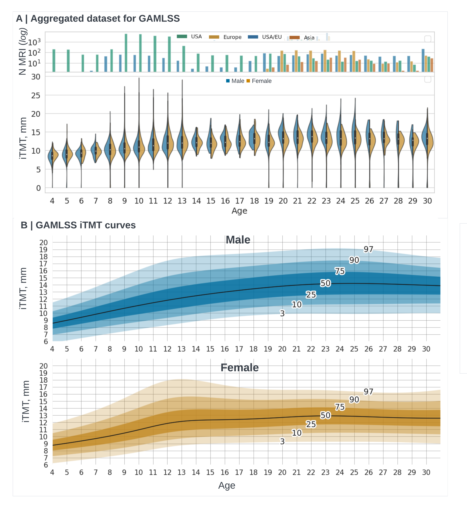

# Automated Deep Learning TM-segmentation project
[](https://doi.org/10.5281/zenodo.8361032)

Link to the centiles web-page: [itmt-icsa.streamlit.app](https://itmt-icsa.streamlit.app/)

We developed an automated deep learning pipeline to accurately measure temporalis muscle thickness (iTMT) from routine brain magnetic resonance imaging (MRI). We applied iTMT to 23,852 MRIs of healthy subjects, ages 4 through 35, and generated sex-specific iTMT normal growth charts with percentiles. We found that iTMT was associated with specific physiologic traits, including caloric intake, physical activity, sex hormone levels, and the presence of malignancy. We validated iTMT across multiple demographic groups and in children with brain tumors and demonstrated the feasibility for individualized longitudinal monitoring. The iTMT pipeline provides unprecedented insights into temporalis muscle growth during human development and enables the use of LMM tracking to inform clinical decision-making.

**If you publish any work which uses this package, please cite the following publication**: [doi.org/10.1038/s41467-023-42501-1](https://doi.org/10.1038/s41467-023-42501-1)


**Not intended for clinical use.**

## Hardware requirements
This repository was developed and tested on the following hardware:
- Ubuntu 22.04.1 LTS, 1x Nvidia RTX A6000 GPU

## Software requirements
- Docker 

OR

- Python 3.9 (not required for docker version)
- Conda (not required for docker version)
- Elastix. Installation instructions below for Linux (for other OS please refer to the elastix [documentation](https://github.com/SuperElastix/elastix/releases/download/5.1.0/elastix-5.1.0-manual.pdf)). Elastix installation is not requred for the docker version: 
    - Download and upzip [elastix](https://github.com/SuperElastix/elastix/releases/tag/5.1.0)
    - Add to ~/.bashrc:
    ```
    export PATH=path/bin:$PATH
    export LD_LIBRARY_PATH=path/lib:$LD_LIBRARY_PATH
    ```
    - Run `source ~/.bashrc`
    - Make all files in bin executable: `chmod -R +x path/bin`
    - Test: `elastix --help`

## Quick Start - Docker(single MRI T1 inference, no GPU required), estimated time for set up: 5-10 minutes
**Prerequisites: docker** 
1. Clone repo `git clone`

2. To create a docker:
`cd docker`
`docker build -t itmt -f Dockerfile . --no-cache`

3. To run docker on example MRI:
`docker run -it itmt`

4. To run docker on your own MRI:
`docker run -it -v local_folder_with_nii_path:/out itmt python3.9 ./main.py --age X --gender X --img_path out/file.nii --path_to out`

- local_folder_with_nii_path is the path to the folder with your MRI and file.nii is the name of the MRI file; it is also the path to the output folder where the results will be saved.
- in `--age X`, X should be replaced with the age of the subject in years
- in `--gender X`, X should be M or F, a biological gender of the subject

## Quick Start - No Docker (single MRI T1 inference)
**Prerequisites: conda, gpu** 

1. Clone repo `git clone`

2. To create an enviroment, run: 
`conda env create -f environment.yml`

3. To activate the enviroment:
`conda activate tf2-py39`

4. Modify settings (for example available GPUs) in `settings.py`

5. For demo on TM pipeline launch jupyter notebook `example_notebooks/demo_notebook.ipynb` inside conda enviroment. Estimated inference time: 5 minutes

## To retrain on your own MRI dataset: 
**Prerequisites: conda, gpu** 

0. Create enviroment:
- Clone repo `git clone`
- `conda env create -f environment.yml`
- `conda activate tf2-py39`

1. Data preprocessing pipeline:
- `data_curation_scripts/` - folder that copies mries from elsewhere localy, based on age and how many of the scans are needed per age, do not include in final code release
- `preprocessing/` - folder with preprocessing scripts
- `preprocessing/registration_mni.py` - register based on age to the mni templates
- `preprocessing/masks_to_npy.py` - preprocess mris for the Unet
- `preprocessing/sitk_resample.py` - preprocess mris for the DenseNet
- Run the registration and z-norm for all MRIs in folder: `python scripts/preprocess_utils.py` -> `z_enhance_and_debias_all_in_path(image_dir,path_to,input_annotation_file)` (this is done to speed up training and preprocessing, we opt for the normalizing all mris in one go instead of doing it twice for each network)

2. To train densenet for the slice prediction:
- (*)After `z_enhance_and_debias_all_in_path` you can prep dataset for the training
- Prepare the data: `python preprocessing/sitk_resample.py` - creates train/test with slice offset
- Train `python train_slice_selection.py`
- Move the final `Top_Weights.hdf` into the test folder and modify `test_slice_selection.py` with your paths
- Eval `python test_slice_selection.py`

3. To train the unet for segmentation:
- (*)After `z_enhance_and_debias_all_in_path` you can prep dataset for the training
- Prepare the data: `python preprocessing/masks_to_npy.py` creates 4 .npy filese: two val and two train, two images and two masks
- Train `python train_segmentation.py`
- Move the final `Top_Weights.hdf` into the test folder and modify if you change paths
- Eval `python test_segmentation.py -u True` if metrics measurements are needed

4. To compute CSA/TMT for all images in folder:
- Curate the dataset and run preprocessing rescale_healthy.py
- Run compute_csa_by_path.py which will output the .csv with the predicted slice and TM measurements

## Acknowledgements
* [ITKElastix](https://github.com/InsightSoftwareConsortium/ITKElastix)
* [Feret](https://github.com/matthiasnwt/feret)

### LICENSE: CC BY-NC 4.0

This work is licensed under the Creative Commons Attribution-NonCommercial 4.0 International License.
To view a copy of this license, visit <http://creativecommons.org/licenses/by-nc/4.0/> or send a letter to Creative Commons, PO Box 1866, Mountain View, CA 94042, USA.
Copyright (c) [2023] [Automated Deep Learning TM-segmentation project]
