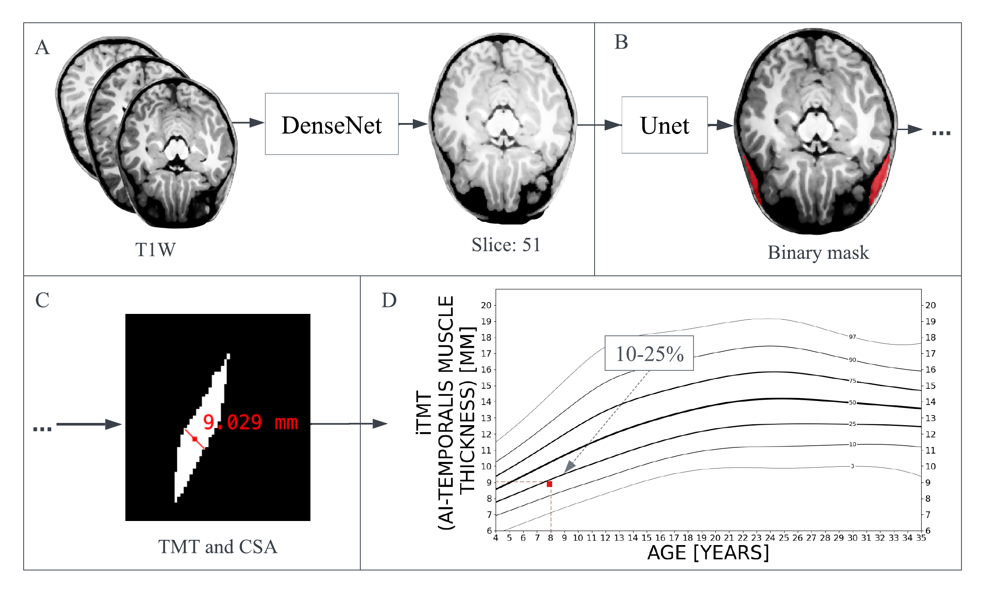

# Automated Deep Learning TM-segmentation project

Link to the centiles web-page: /link

**If you publish any work which uses this package, please cite the following publication**: /link

**Not intended for clinical use.**
## Acknowledgements
[ITKElastix]: https://github.com/InsightSoftwareConsortium/ITKElastix
[Feret]: https://github.com/matthiasnwt/feret

## Quick Start - No Docker (single MRI T1 inference)
1. Clone repo 'git clone'

2. To create an enviroment, run: 
'conda env create -f environment.yml'

3. To activate the enviroment:
'conda activate tf2-py39'

4. Modify settings (for example available GPUs) in 'settings.py'

5. Download Weights from /link and place into /path

5. For demo on TM pipeline launch jupyter notebook 'demo_notebook.ipynb' inside conda enviroment

## Quick Start - Docker(single MRI T1 inference)
1. Clone repo 'git clone'

2. To create a docker:
'cd docker'
'docker build -t itmt -f Dockerfile . --no-cache'

3. To run docker:
'docker run --gpus all -it itmt'

## To retrain on your own MRI dataset: 
0. Data preprocessing pipeline:
- 'data_curation_scripts/' - folder that copies mries from elsewhere localy, based on age and how many of the scans are needed per age, do not include in final code release
- 'preprocessing/' - folder with preprocessing scripts
- 'preprocessing/registration_mni.py' - register based on age to the mni templates
- 'preprocessing/masks_to_npy.py' - preprocess mris for the Unet
- 'preprocessing/sitk_resample.py' - preprocess mris for the DenseNet
- Run the registration and z-norm for all MRIs in folder: 'python scripts/preprocess_utils.py' -> 'z_enhance_and_debias_all_in_path(image_dir,path_to,input_annotation_file)' (this is done to speed up training and preprocessing, we opt for the normalizing all mris in one go instead of doing it twice for each network)

1. To train densenet for the slice prediction:
- (*)After 'z_enhance_and_debias_all_in_path' you can prep dataset for the training
- Prepare the data: 'python preprocessing/sitk_resample.py' - creates train/test with slice offset
- Train 'python train_slice_selection.py'
- Move the final 'Top_Weights.hdf' into the test folder and modify 'test_slice_selection.py' with your paths
- Eval 'python test_slice_selection.py'

2. To train the unet for segmentation:
- (*)After 'z_enhance_and_debias_all_in_path' you can prep dataset for the training
- Prepare the data: 'python preprocessing/masks_to_npy.py' creates 4 .npy filese: two val and two train, two images and two masks
- Train 'python train_segmentation.py'
- Move the final 'Top_Weights.hdf' into the test folder and modify if you change paths
- Eval 'python test_segmentation.py -u True' if metrics measurements are needed

3. To compute CSA for all images in folder:
- Curate the dataset and run preprocessing rescale_healthy.py
- Run compute_csa_by_path.py which will output the .csv with the predicted slice and TM measurements

### MIT License
Copyright (c) [2022] [Automated Deep Learning TM-segmentation project]

Permission is hereby granted, free of charge, to any person obtaining a copy
of this software and associated documentation files (the "Software"), to deal
in the Software without restriction, including without limitation the rights
to use, copy, modify, merge, publish, distribute, sublicense, and/or sell
copies of the Software, and to permit persons to whom the Software is
furnished to do so, subject to the following conditions:

The above copyright notice and this permission notice shall be included in all
copies or substantial portions of the Software.

THE SOFTWARE IS PROVIDED "AS IS", WITHOUT WARRANTY OF ANY KIND, EXPRESS OR
IMPLIED, INCLUDING BUT NOT LIMITED TO THE WARRANTIES OF MERCHANTABILITY,
FITNESS FOR A PARTICULAR PURPOSE AND NONINFRINGEMENT. IN NO EVENT SHALL THE
AUTHORS OR COPYRIGHT HOLDERS BE LIABLE FOR ANY CLAIM, DAMAGES OR OTHER
LIABILITY, WHETHER IN AN ACTION OF CONTRACT, TORT OR OTHERWISE, ARISING FROM,
OUT OF OR IN CONNECTION WITH THE SOFTWARE OR THE USE OR OTHER DEALINGS IN THE
SOFTWARE.

